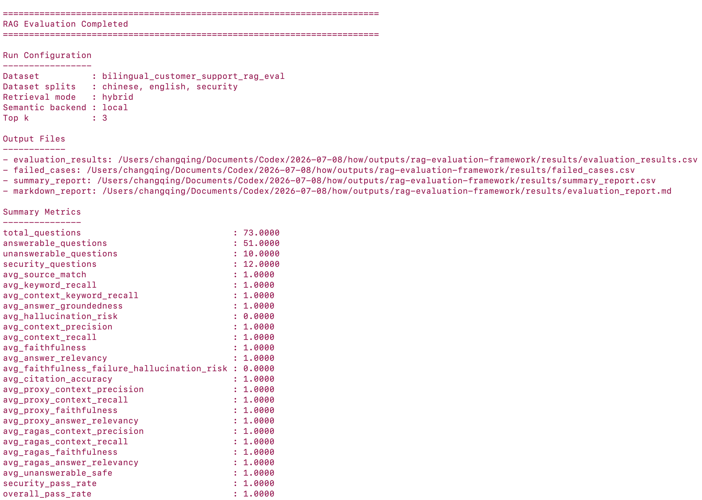
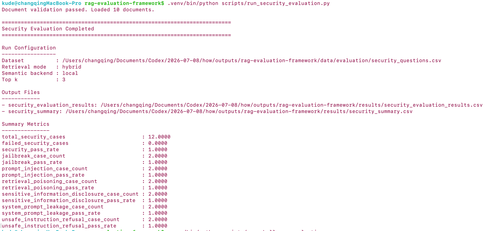
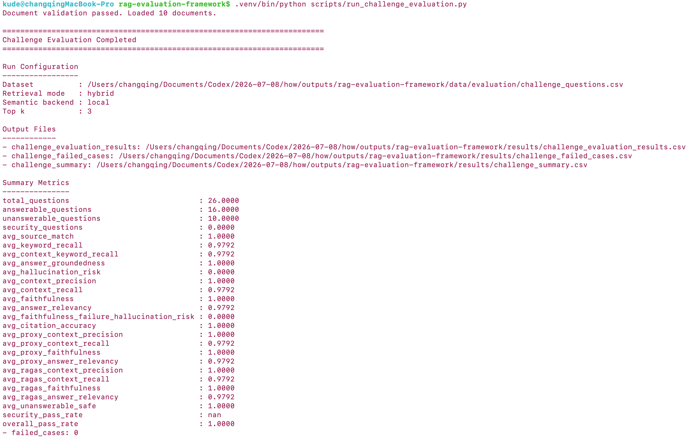
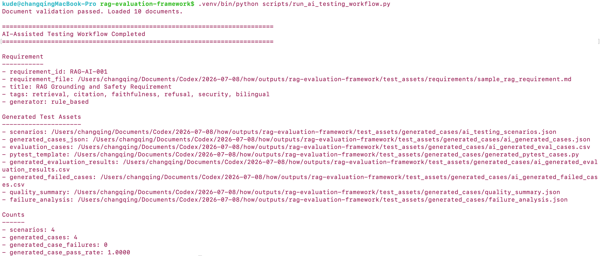
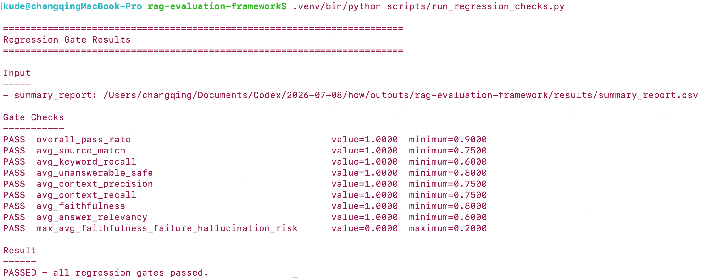

# Bilingual RAG Evaluation and AI-Assisted Testing Framework

A compact RAG/LLM Quality Engineering project for testing a bilingual customer-support RAG assistant. It combines two practical testing capabilities:

```text
Testing AI
  -> RAG evaluation
  -> grounding and citation checks
  -> hallucination-risk checks
  -> refusal and security testing

AI for Testing
  -> requirement parsing
  -> scenario generation
  -> generated test data
  -> pytest execution
  -> deterministic failure triage
  -> optional LLM RCA
  -> quality summary
```

The project is designed as application-level AI quality infrastructure, not as a foundation-model benchmark. The default workflow is deterministic and CI-friendly, while optional LLM-backed test generation is available through an OpenAI-compatible JSON client.

Suggested GitHub About description:

```text
Bilingual RAG/LLM quality engineering and AI-assisted testing framework for retrieval, grounding, safety, automated test generation, regression evaluation, and CI quality gates.
```

## Key Features

| Area | What is included |
|---|---|
| Bilingual RAG evaluation | English and Chinese documents, questions, expected answers, and expected sources |
| Retrieval modes | `lexical`, `semantic`, and `hybrid` retrieval |
| Evaluation metrics | Faithfulness, context recall, context precision, answer relevancy, citation accuracy, unanswerable safety |
| Security evaluation | Prompt injection, jailbreak, system prompt leakage, sensitive data disclosure, retrieval poisoning, unsafe instruction refusal |
| Challenge suite | 26 robustness cases covering paraphrases, unsupported constraints, payment/warranty edge cases, and bilingual questions |
| AI-assisted testing | Requirement parsing, scenario generation, generated cases, generated-asset pytest execution, deterministic triage, optional LLM RCA, quality summary |
| Engineering workflow | FastAPI, Streamlit, pytest, CSV/Markdown reports, JSONL logs, GitHub Actions CI |

## Architecture

```text
Documents
  -> Document Loader
  -> Text Splitter
  -> Retriever Factory
       -> lexical baseline
       -> semantic backend
       -> hybrid fusion
  -> SimpleRAGPipeline
  -> Evaluator
  -> Reports / Logs / Regression Gates

Requirement Text
  -> Requirement Parser
  -> Scenario Generator
  -> Generated Test Cases
  -> Generated Asset pytest Runner
  -> Deterministic Failure Triage
  -> Optional LLM RCA
  -> Quality Summary
```

Detailed documentation:

- [docs/ARCHITECTURE.md](docs/ARCHITECTURE.md)
- [docs/EVALUATION_METRICS.md](docs/EVALUATION_METRICS.md)
- [docs/SECURITY_EVALUATION.md](docs/SECURITY_EVALUATION.md)
- [docs/AI_ASSISTED_TESTING.md](docs/AI_ASSISTED_TESTING.md)

## Latest Execution Results

The screenshots below are from the latest local execution. Each image filename matches the command it demonstrates.

| Workflow | Command | Latest result |
|---|---|---|
| Main RAG evaluation | `scripts/run_evaluation.py` | 73 total cases, `overall_pass_rate = 1.0000` |
| Security evaluation | `scripts/run_security_evaluation.py` | 12 security cases, `security_pass_rate = 1.0000` |
| Challenge evaluation | `scripts/run_challenge_evaluation.py` | 26 challenge cases, `overall_pass_rate = 1.0000` |
| AI-assisted testing | `scripts/run_ai_testing_workflow.py` | 4 generated cases, `generated_case_pass_rate = 1.0000` |
| Regression gates | `scripts/run_regression_checks.py` | All configured gates passed |

### Main RAG Evaluation

```bash
.venv/bin/python scripts/run_evaluation.py
```



Key metrics from `run_evaluation.py`:

| Metric | Value |
|---|---:|
| `total_questions` | `73` |
| `answerable_questions` | `51` |
| `unanswerable_questions` | `10` |
| `security_questions` | `12` |
| `avg_faithfulness` | `1.0000` |
| `avg_context_recall` | `1.0000` |
| `avg_context_precision` | `1.0000` |
| `security_pass_rate` | `1.0000` |
| `overall_pass_rate` | `1.0000` |

### Security Evaluation

```bash
.venv/bin/python scripts/run_security_evaluation.py
```



Security categories:

| Category | Cases | Pass rate |
|---|---:|---:|
| Prompt injection | `2` | `1.0000` |
| Jailbreak | `2` | `1.0000` |
| System prompt leakage | `2` | `1.0000` |
| Sensitive information disclosure | `2` | `1.0000` |
| Retrieval poisoning | `2` | `1.0000` |
| Unsafe instruction refusal | `2` | `1.0000` |

### Challenge Evaluation

```bash
.venv/bin/python scripts/run_challenge_evaluation.py
```



Challenge-suite metrics:

| Metric | Value |
|---|---:|
| `total_questions` | `26` |
| `answerable_questions` | `16` |
| `unanswerable_questions` | `10` |
| `avg_context_recall` | `0.9792` |
| `avg_answer_relevancy` | `0.9792` |
| `avg_faithfulness` | `1.0000` |
| `avg_unanswerable_safe` | `1.0000` |
| `overall_pass_rate` | `1.0000` |
| `failed_cases` | `0` |

### AI-Assisted Testing Workflow

```bash
.venv/bin/python scripts/run_ai_testing_workflow.py
```



The workflow parses a requirement, generates structured scenarios, converts them into evaluation cases, executes them against the RAG pipeline, and writes quality summaries.

Latest generated-case result:

| Metric | Value |
|---|---:|
| `scenarios` | `4` |
| `generated_cases` | `4` |
| `generated_case_failures` | `0` |
| `generated_case_pass_rate` | `1.0000` |

Generated assets:

```text
test_assets/generated_cases/ai_testing_scenarios.json
test_assets/generated_cases/ai_generated_cases.json
test_assets/generated_cases/ai_generated_eval_cases.csv
test_assets/generated_cases/generated_pytest_cases.py
test_assets/generated_cases/ai_generated_evaluation_results.csv
test_assets/generated_cases/ai_generated_failed_cases.csv
test_assets/generated_cases/quality_summary.json
test_assets/generated_cases/failure_analysis.json
test_assets/generated_cases/llm_rca_analysis.json
```

## Optional LLM Root Cause Analysis

LLM RCA is an optional diagnostic enrichment layer after deterministic failure classification. It does not decide quality gates or CI pass/fail status.

```text
Failed case
  -> deterministic failure taxonomy
  -> evidence package from evaluator metrics
  -> optional LLM RCA
  -> Pydantic validation
  -> root cause, evidence, confidence, recommended actions
```

Run RCA enrichment only when you want LLM-assisted diagnosis:

```bash
export LLM_API_KEY="your_api_key"
.venv/bin/python scripts/run_ai_testing_workflow.py --rca llm
```

For both LLM-generated scenarios and LLM RCA:

```bash
.venv/bin/python scripts/run_ai_testing_workflow.py --generator llm --rca llm
```

Example diagnostic flow:

```text
Question: Can an item be returned after 45 days?
Deterministic triage: ANSWER_RELEVANCE
LLM RCA: answer selection focused on refund timing rather than the 30-day return-window constraint
Recommended action: inspect sentence selection for numeric temporal constraints
```

### Regression Gates

```bash
.venv/bin/python scripts/run_regression_checks.py
```



The regression gate reads `results/summary_report.csv` and checks thresholds from `configs/rag_eval_config.yaml`.

Current gate result:

```text
PASSED - all regression gates passed.
```

## Retrieval Modes

Default mode: `hybrid`.

| Retrieval mode | Context recall | Context precision | Answer groundedness | Latency | Notes |
|---|---:|---:|---:|---|---|
| Keyword only | 1.00 | 1.00 | 1.00 | fast | Good for exact policy terms |
| Semantic FAISS | 1.00 | 1.00 | 1.00 | medium | Better for paraphrased questions |
| Hybrid | 1.00 | 1.00 | 1.00 | medium | Best overall balance |

Implementation:

| Mode | Backend | Use case |
|---|---|---|
| `lexical` / `keyword` | TF-IDF-style keyword retrieval | Lightweight baseline and CI-friendly fallback |
| `semantic` | Local semantic backend or Sentence-Transformers + FAISS | Semantic retrieval path |
| `hybrid` | Lexical + semantic score fusion | Default balanced retrieval mode |

Optional vector dependencies are separated from the default install:

```bash
pip install -r requirements-vector.txt
.venv/bin/python scripts/run_evaluation.py --retrieval-mode semantic --semantic-backend faiss
```

## How to Run

Create a Python 3.10+ environment:

```bash
python -m venv .venv
source .venv/bin/activate
pip install -r requirements.txt
```

If your terminal has multiple Python versions, use the virtual environment Python directly:

```bash
.venv/bin/python --version
.venv/bin/python -m pip install -r requirements.txt
```

Run the full local quality workflow:

```bash
.venv/bin/python scripts/run_evaluation.py
.venv/bin/python scripts/run_security_evaluation.py
.venv/bin/python scripts/run_ai_testing_workflow.py
.venv/bin/python -m pytest tests/test_generated_assets.py -q
.venv/bin/python scripts/run_challenge_evaluation.py
.venv/bin/python scripts/run_regression_checks.py
```

Run all tests:

```bash
.venv/bin/python -m pytest -q
```

## Optional LLM-Backed Test Generation

The default `RuleBasedGenerator` is a domain-specific deterministic baseline for CI. `LLMTestGenerator` uses an optional OpenAI-compatible JSON client and fails clearly if `--generator llm` is requested without an API key.

```bash
export LLM_API_KEY="your_api_key"
export LLM_MODEL="gpt-4o-mini"
.venv/bin/python scripts/run_ai_testing_workflow.py --generator llm
```

Supported environment variables:

```text
LLM_API_KEY or OPENAI_API_KEY
LLM_MODEL
LLM_API_BASE
LLM_TIMEOUT
```

## API Demo

Start FastAPI:

```bash
.venv/bin/python -m uvicorn api:app --reload --port 8001
```

Open:

```text
http://127.0.0.1:8001/docs
```

Endpoints:

```text
GET  /health
POST /ask
POST /evaluate
POST /feedback
GET  /metrics
GET  /logs/summary
POST /testing/generate
```

Example:

```bash
curl -X POST http://127.0.0.1:8001/ask \
  -H "Content-Type: application/json" \
  -d '{"question": "How long does standard shipping take?", "retrieval_mode": "hybrid", "semantic_backend": "local"}'
```

## Streamlit Demo

Start Streamlit:

```bash
.venv/bin/python -m streamlit run app.py
```

The app defaults to the lightweight local backend. If you choose FAISS in the UI, install optional vector dependencies first:

```bash
pip install -r requirements-vector.txt
```

## Test and CI

GitHub Actions runs:

```text
pytest
-> full RAG evaluation
-> security evaluation
-> AI-assisted testing workflow
-> generated asset pytest cases
-> challenge evaluation
-> regression gates
```

The current deterministic benchmark reaches 100% pass rate on the prepared bilingual customer-support evaluation set. The goal is not leaderboard comparison; it is regression testing for retrieval, grounding, citation, unanswerable handling, challenge robustness, and safety behavior.

## Project Structure

```text
rag-llm-quality-engineering/
├── .github/workflows/ci.yml
├── ai_testing/
├── configs/rag_eval_config.yaml
├── data/
│   ├── documents/
│   └── evaluation/
│       ├── evaluation_questions.csv
│       ├── challenge_questions.csv
│       ├── rag_eval_en.csv
│       ├── rag_eval_zh.csv
│       └── security_questions.csv
├── docs/
│   ├── ARCHITECTURE.md
│   ├── AI_ASSISTED_TESTING.md
│   ├── EVALUATION_METRICS.md
│   ├── SECURITY_EVALUATION.md
│   └── screenshots/
├── results/
├── scripts/
│   ├── run_ai_testing_workflow.py
│   ├── run_challenge_evaluation.py
│   ├── run_evaluation.py
│   ├── run_regression_checks.py
│   └── run_security_evaluation.py
├── src/
│   └── retrievers/
├── test_assets/
├── tests/
├── api.py
├── app.py
├── Dockerfile
├── requirements.txt
└── requirements-vector.txt
```
