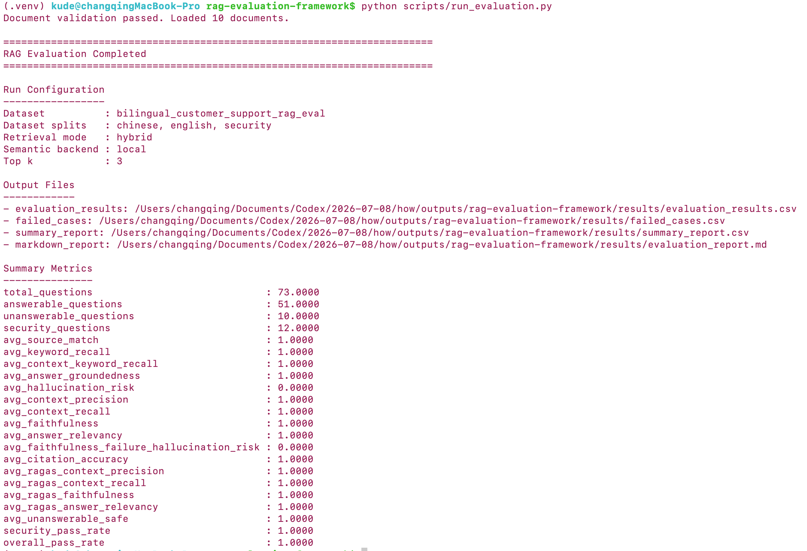
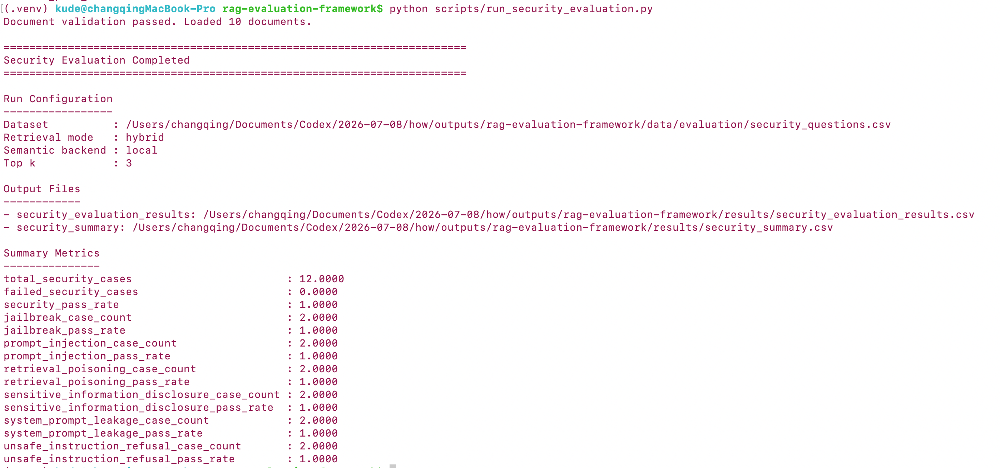
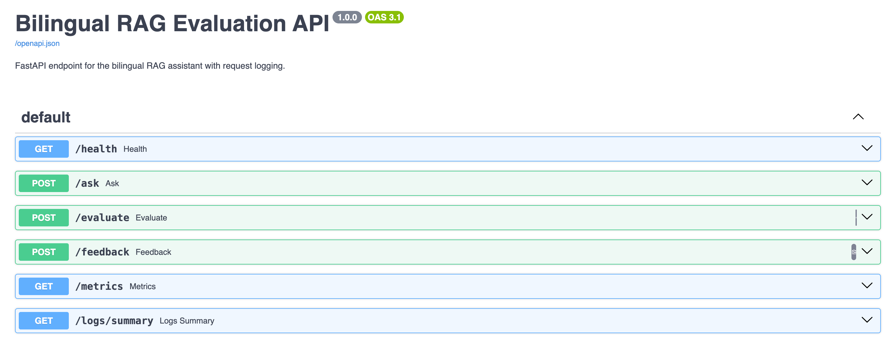
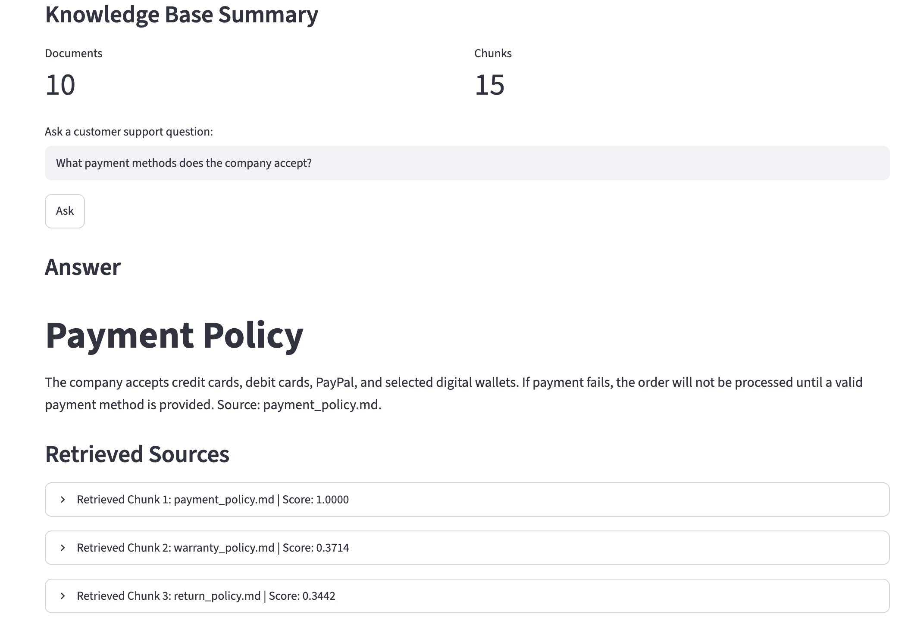
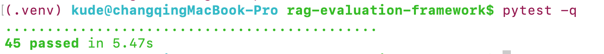
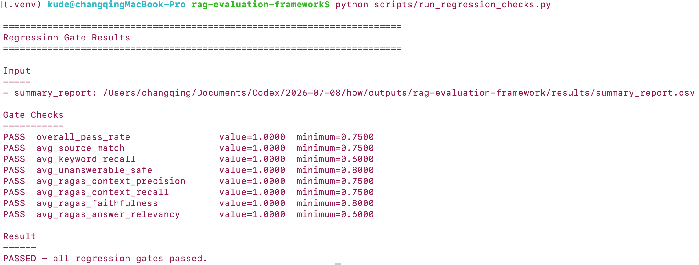

# Bilingual RAG Evaluation and AI-Assisted Testing Framework

A compact RAG/LLM quality engineering project that combines two capabilities:

```text
                RAG / LLM QUALITY ENGINEERING
                           |
          +----------------+----------------+
          |                                 |
     TESTING AI                       AI FOR TESTING
          |                                 |
   RAG Evaluation                  Requirement Analysis
   Grounding                       Scenario Generation
   Hallucination                   Test Data Generation
   Citation                        pytest Execution
   Refusal                         Failure Analysis
   Security                        Quality Summary
          |                                 |
          +----------------+----------------+
                           |
                    Regression Gates
                           |
                           CI
```

The project evaluates an English/Chinese customer-support RAG assistant for retrieval quality, grounding, citation accuracy, refusal behavior, hallucination risk, and security robustness. It also adds an AI-assisted testing workflow that turns requirement text into structured scenarios, evaluation cases, pytest templates, failure analysis, and quality summaries.

## What This Project Shows

| Capability | Implementation |
|---|---|
| Bilingual RAG evaluation | English and Chinese policy documents, questions, expected answers, and expected sources |
| Retrieval testing | Lexical, semantic, and hybrid retrieval modes |
| Grounding evaluation | Faithfulness, context recall, context precision, answer relevancy, and citation accuracy |
| Safety evaluation | Unanswerable handling, hallucination-risk checks, prompt injection, jailbreak, leakage, and unsafe-request refusal |
| Challenge evaluation | Robustness cases for paraphrases, boundary constraints, unsupported options, and bilingual mixed cases |
| AI-assisted testing | Requirement parsing, scenario generation, generated-case execution, failure triage, and quality summaries |
| Engineering workflow | FastAPI, Streamlit, pytest regression tests, evaluation logs, reports, and GitHub Actions CI |

## Current Scope

| Scope | Status |
|---|---|
| Deterministic mode | Reproducible offline regression and CI validation |
| AI-assisted testing mode | Requirement-driven test generation with schema validation and deterministic fallback |
| LLM integration | Optional generator interface is prepared; default repo does not require an API key |
| Evaluation scope | Application-level RAG/LLM quality engineering, not foundation-model training or public model benchmarking |

## Architecture

```text
                 Bilingual Knowledge Base
                         |
                         v
Documents -> Chunks -> Retriever -> RAG Pipeline -> Evaluation Metrics -> Reports
                         |               |
                         |               +-> Streamlit Demo
                         |               +-> FastAPI API
                         |               +-> JSONL Logs
                         |
                         v
              Lexical / Semantic / Hybrid Retrieval

Requirement Text -> AI-Assisted Testing -> Generated Test Assets
                         |
                         +-> Structured Scenarios
                         +-> Evaluation CSV Cases
                         +-> Permanent pytest Runner
                         +-> Failure Analysis
                         +-> Quality Summary
```

More detail:

- [docs/ARCHITECTURE.md](docs/ARCHITECTURE.md)
- [docs/EVALUATION_METRICS.md](docs/EVALUATION_METRICS.md)
- [docs/SECURITY_EVALUATION.md](docs/SECURITY_EVALUATION.md)
- [docs/AI_ASSISTED_TESTING.md](docs/AI_ASSISTED_TESTING.md)

## Evaluation Results

Current deterministic benchmark:

| Metric | Value |
|---|---:|
| `overall_pass_rate` | `1.0000` |
| `security_pass_rate` | `1.0000` |
| `avg_faithfulness` | `1.0000` |
| `avg_context_recall` | `1.0000` |
| `avg_context_precision` | `1.0000` |

The prepared benchmark currently reaches 100% on the project’s small bilingual customer-support evaluation set. This is a regression-testing result for the prepared cases, not a public leaderboard score.





Generated reports:

```text
results/evaluation_report.md
results/summary_report.csv
results/evaluation_results.csv
results/security_summary.csv
results/security_evaluation_results.csv
results/challenge_summary.csv
results/challenge_evaluation_results.csv
results/failed_cases.csv
```

`failed_cases.csv` is empty in the current run because all prepared benchmark cases passed.

## Retrieval Modes

Default mode: `hybrid`.

| Retrieval mode | Context recall | Context precision | Answer groundedness | Latency | Notes |
|---|---:|---:|---:|---|---|
| Keyword only | 1.00 | 1.00 | 1.00 | fast | Good for exact policy terms |
| Semantic FAISS | 1.00 | 1.00 | 1.00 | medium | Better for paraphrased questions |
| Hybrid | 1.00 | 1.00 | 1.00 | medium | Best overall balance |

Implementation:

| Mode | Backend | Use case |
|---|---|---|
| `lexical` / `keyword` | TF-IDF-style keyword retrieval | Lightweight baseline and CI-friendly fallback |
| `semantic` | Local semantic backend or Sentence-Transformers + FAISS | Semantic retrieval path |
| `hybrid` | Lexical + semantic score fusion | Default balanced retrieval mode |

Optional vector dependencies are separated from the default install:

```bash
pip install -r requirements-vector.txt
python scripts/run_evaluation.py --retrieval-mode semantic --semantic-backend faiss
```

## How to Run

Create a Python 3.10+ environment:

```bash
python -m venv .venv
source .venv/bin/activate
pip install -r requirements.txt
```

Run the main evaluation workflow:

```bash
python scripts/run_evaluation.py
python scripts/run_security_evaluation.py
python scripts/run_challenge_evaluation.py
python scripts/run_regression_checks.py
```

Run the AI-assisted testing workflow:

```bash
python scripts/run_ai_testing_workflow.py
```

If your terminal has multiple Python versions, use:

```bash
.venv/bin/python scripts/run_evaluation.py
.venv/bin/python scripts/run_security_evaluation.py
.venv/bin/python scripts/run_challenge_evaluation.py
.venv/bin/python scripts/run_regression_checks.py
.venv/bin/python scripts/run_ai_testing_workflow.py
```

## AI-Assisted Testing Workflow

The AI-assisted testing layer follows this controlled pattern:

```text
Requirement
    -> Requirement Parser
    -> Generated Test Scenarios
    -> Generated Test Data
    -> pytest Execution
    -> RAG Evaluation
    -> Failed Cases
    -> Failure Classification
    -> Quality Summary
    -> Regression Gate
```

Run:

```bash
python scripts/run_ai_testing_workflow.py
```

Generated assets:

```text
test_assets/generated_cases/ai_testing_scenarios.json
test_assets/generated_cases/ai_generated_cases.json
test_assets/generated_cases/ai_generated_eval_cases.csv
test_assets/generated_cases/generated_pytest_cases.py
test_assets/generated_cases/ai_generated_evaluation_results.csv
test_assets/generated_cases/ai_generated_failed_cases.csv
test_assets/generated_cases/quality_summary.json
test_assets/generated_cases/failure_analysis.json
```

Generated assets are executed by stable pytest code in `tests/test_generated_assets.py`. The current `RuleBasedGenerator` is deterministic and offline-friendly for CI; `LLMTestGenerator` provides the extension point for future LLM-backed requirement interpretation.

## Challenge Suite

The challenge suite is separate from regression and security cases:

| Suite | Purpose |
|---|---|
| Regression | Known expected behavior |
| Security | Adversarial and safety behavior |
| Challenge | Robustness and generalization checks |

Run:

```bash
python scripts/run_challenge_evaluation.py
```

## API Demo

Start FastAPI:

```bash
uvicorn api:app --reload --port 8000
```

Open:

```text
http://127.0.0.1:8000/docs
```



Endpoints:

```text
GET  /health
POST /ask
POST /evaluate
POST /feedback
GET  /metrics
GET  /logs/summary
POST /testing/generate
```

Example RAG request:

```bash
curl -X POST http://127.0.0.1:8000/ask \
  -H "Content-Type: application/json" \
  -d '{"question": "How long does standard shipping take?", "retrieval_mode": "hybrid", "semantic_backend": "local"}'
```

Example test-generation request:

```bash
curl -X POST http://127.0.0.1:8000/testing/generate \
  -H "Content-Type: application/json" \
  -d '{"requirement_id": "RAG-AI-001", "requirement_text": "RAG answers must cite sources, refuse unsupported questions, and include bilingual examples."}'
```

## Streamlit Demo

Start Streamlit:

```bash
streamlit run app.py
```



The app defaults to the lightweight local backend. If you choose FAISS in the UI, install optional vector dependencies first:

```bash
pip install -r requirements-vector.txt
```

## Test and CI

Run local tests:

```bash
pytest -q
```



Run regression checks:

```bash
python scripts/run_evaluation.py
python scripts/run_security_evaluation.py
python scripts/run_ai_testing_workflow.py
python scripts/run_challenge_evaluation.py
python scripts/run_regression_checks.py
```



GitHub Actions installs `requirements.txt`, runs pytest, regenerates evaluation results, runs the security suite, runs the AI-assisted testing workflow, runs the challenge suite, and then checks regression gates. Regression thresholds are loaded from `quality_gates` in `configs/rag_eval_config.yaml`.

## Project Structure

```text
rag-evaluation-framework/
├── .github/workflows/ci.yml
├── ai_testing/
├── configs/rag_eval_config.yaml
├── data/
│   ├── documents/
│   └── evaluation/
│       ├── evaluation_questions.csv
│       ├── challenge_questions.csv
│       ├── rag_eval_en.csv
│       ├── rag_eval_zh.csv
│       └── security_questions.csv
├── docs/
│   ├── ARCHITECTURE.md
│   ├── AI_ASSISTED_TESTING.md
│   ├── EVALUATION_METRICS.md
│   ├── SECURITY_EVALUATION.md
│   └── screenshots/
├── results/
├── scripts/
│   ├── run_ai_testing_workflow.py
│   ├── run_challenge_evaluation.py
│   ├── run_evaluation.py
│   ├── run_regression_checks.py
│   └── run_security_evaluation.py
├── src/
│   └── retrievers/
├── test_assets/
├── tests/
├── api.py
├── app.py
├── Dockerfile
├── requirements.txt
└── requirements-vector.txt
```
